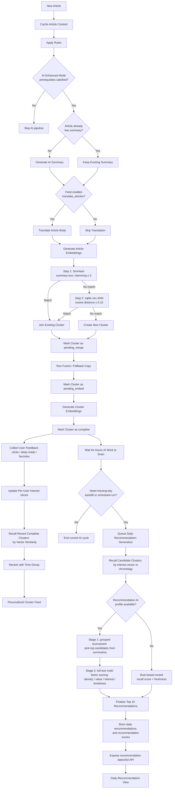

# MavenRSS (fork from [MrRSS](https://github.com/WCY-dt/MrRSS))

<p>
   <strong>English</strong> | <a href="README_zh.md">简体中文</a>
</p>

[!\[Version\](https://img.shields.io/badge/version-1.3.20-blue.svg null)](https://github.com/WCY-dt/MavenRSS/releases)
[!\[License\](https://img.shields.io/badge/license-GPLv3-green.svg null)](LICENSE)
[!\[Go\](https://img.shields.io/badge/Go-1.25+-00ADD8?logo=go null)](https://go.dev/)
[!\[Wails\](https://img.shields.io/badge/Wails-v3%20alpha-red null)](https://wails.io/)
[!\[Vue.js\](https://img.shields.io/badge/Vue.js-3.5+-4FC08D?logo=vue.js null)](https://vuejs.org/)

## ✨ Features

- 🌐 **Web & Desktop Deployment**: Choose between a native desktop application (Windows/macOS/Linux) or a self-hosted web server with multi-user access
- 🔐 **User Authentication**: Secure login/registration system with JWT-based authentication and multi-tenant support
- 🌍 **Auto-Translation & Summarization**: Automatically translate article titles and content, and generate concise summaries to help you get information quickly
- 🤖 **AI-Enhanced Features**: Integrated advanced AI technology for translation, summarization, recommendations, and more, making reading smarter
- 🔌 **Rich Plugin Ecosystem**: Supports integration with mainstream tools like Obsidian, Notion, FreshRSS, and RSSHub for easy feature extension
- 📡 **Diverse Subscription Methods**: Supports URL, XPath, scripts, newsletters, and other feed types to meet different needs
- 🏭 **Custom Scripts & Automation**: Built-in filters and scripting system supporting highly customizable automation workflows
- 📱 **Mobile-Friendly**: Responsive design optimized for mobile devices with faster load times and smoother user experience

## 🧠 AI-Enhanced Mode

AI-Enhanced Mode turns MavenRSS from a feed reader into an AI-powered reading assistant. After articles are fetched, the system can merge related content into article clusters, continuously improve recommendations based on reading behavior, and generate daily top-10 recommendations using multi-dimensional model scoring. The result is a reading experience that helps you understand articles faster, stay less distracted by repeated information, and discover content that better matches your interests.

### Key AI Features

- **Article Deduplication & Clustering**: With **SimHash** and **sqlite-vec**, related articles can be grouped into the same **Cluster**, reducing repetitive reading and making ongoing topics easier to follow.
- **Interest-Based Ranking**: The system can continuously update a per-user interest vector based on clicks, deep reads, and favorites.
- **AI Daily Recommendations**: Daily recommendations are not based on vector similarity alone. Candidate summaries first go through a grouped tournament, then the full text is scored across multiple dimensions before the final top 10 are selected.
- **Automatic AI Workflow**: Once enabled, new content can move through summary, translation, embedding, clustering, fusion, reranking, daily recommendation scheduling, and missing-day backfill as one continuous pipeline.

### Architecture



## 🚀 Quick Start

### Deployment Options

MavenRSS offers three deployment options:

#### Option 1: Desktop Application (Recommended for Personal Use)

Download the latest installer for your platform from the [Releases](https://github.com/WCY-dt/MrRSS/releases/latest) page of the upstream repository.

#### Option 2: Web Server (Recommended for Teams/Shared Use)

Deploy MavenRSS as a web server for multi-user access.

##### Using Docker (Recommended)

```bash
# Start using Docker Compose
docker-compose up -d

# Or using Docker directly
docker run -d -p 1234:1234 \
  -v mavenrss-data:/app/data \
  --name mavenrss-server \
  ghcr.io/tdroseval/mavenrss:latest
```

Access the web interface at `http://localhost:1234`

##### Configuration

The following environment variables are available for configuration:

- `MRRSS_JWT_SECRET`: Secret key for JWT tokens (required for production)
- `MRRSS_ADMIN_USERNAME`: Admin username
- `MRRSS_ADMIN_EMAIL`: Admin email
- `MRRSS_ADMIN_PASSWORD`: Admin password
- `MRRSS_TEMPLATE_USERNAME`: Template user username
- `MRRSS_TEMPLATE_EMAIL`: Template user email
- `MRRSS_TEMPLATE_PASSWORD`: Template user password

#### Option 3: Build from Source (Desktop)

<details>

<summary>Click to expand the build from source guide</summary>

<div markdown="1">

### Prerequisites

Before you begin, ensure you have the following installed:

- [Go](https://go.dev/) (1.25 or higher)
- [Node.js](https://nodejs.org/) (20 LTS or higher with npm)
- [Wails v3](https://v3alpha.wails.io/getting-started/installation/) CLI

**Platform-specific requirements:**

- **Linux**: GTK3, WebKit2GTK 4.1, libsoup 3.0, GCC, pkg-config
- **Windows**: MinGW-w64 (for CGO support), NSIS (for installers)
- **macOS**: Xcode Command Line Tools

For detailed installation instructions, see [Build Requirements](docs/BUILD_REQUIREMENTS.md)

```bash
# Quick setup for Linux (Ubuntu 24.04+):
sudo apt-get install libgtk-3-dev libwebkit2gtk-4.1-dev libsoup-3.0-dev gcc pkg-config
```

### Installation

1. **Clone the repository**
   ```bash
   git clone https://github.com/TdRoseval/MavenRSS.git
   cd MavenRSS
   ```
2. **Install frontend dependencies**
   ```bash
   cd frontend
   npm install
   cd ..
   ```
3. **Install Wails v3 CLI**
   ```bash
   go install github.com/wailsapp/wails/v3/cmd/wails3@latest
   ```
4. **Build the application**
   ```bash
   # Using Task (recommended)
   task build

   # Or using Makefile
   make build

   # Or directly with wails3
   wails3 build
   ```
   The executable will be created in the `build/bin` directory.
5. **Run the application**
   - Windows: `build/bin/MavenRSS.exe`
   - macOS: `build/bin/MavenRSS.app`
   - Linux: `build/bin/MavenRSS`

</div>

</details>

### Data Storage

<details>

<summary>Click to expand data storage details</summary>

<div markdown="1">

**Desktop Application:**

- **Normal Mode** (default):
  - **Windows:** `%APPDATA%\MavenRSS\` (e.g., `C:\Users\YourName\AppData\Roaming\MavenRSS\`)
  - **macOS:** `~/Library/Application Support/MavenRSS/`
  - **Linux:** `~/.local/share/MavenRSS/`
- **Portable Mode** (when `portable.txt` exists):
  - All data stored in `data/` folder

**Web Server:**

- All data stored in the Docker volume or configured data directory

This ensures your data persists across application updates and reinstalls.

</div>

</details>

## 🛠️ Development Guide

<details>

<summary>Click to expand the development guide</summary>

<div markdown="1">

### Running in Development Mode

Start the application with hot reloading:

```bash
# Using Wails v3
wails3 dev

# Or using Task
task dev
```

### Code Quality Tools

#### Using Make

We provide a `Makefile` for handling common development tasks (available on Linux/macOS/Windows):

```bash
# Show all available commands
make help

# Run full check (lint + test + build)
make check

# Clean build artifacts
make clean

# Setup development environment
make setup
```

### Pre-commit Hooks

This project uses pre-commit hooks to ensure code quality:

```bash
# Install hooks
pre-commit install

# Run on all files
pre-commit run --all-files
```

### Running Tests

```bash
make test
```

</div>

</details>

## 📝 License

This project is licensed under the GPL-3.0 License - see the [LICENSE](LICENSE) file for details.

***

<div align="center">
  <p>Made by AI</p>
  <p>⭐ Star us on GitHub if you find this project useful!</p>
</div>
