# MavenRSS

<p>
   <strong>English</strong> | <a href="README_zh.md">简体中文</a>
</p>

## ✨ Features

- 🌐 **Web & Desktop Deployment**: Choose between a native desktop application (Windows/macOS/Linux) or a self-hosted web server with multi-user access
- 🔐 **User Authentication**: Secure login/registration system with JWT-based authentication and multi-tenant support
- 🌍 **Auto-Translation & Summarization**: Automatically translate article titles and content, and generate concise summaries to help you get information quickly
- 🤖 **AI-Enhanced Features**: Integrated advanced AI technology for translation, summarization, recommendations, and more, making reading smarter
- 🔌 **Rich Plugin Ecosystem**: Supports integration with mainstream tools like Obsidian, Notion, FreshRSS, and RSSHub for easy feature extension
- 📡 **Diverse Subscription Methods**: Supports URL, XPath, scripts, newsletters, and other feed types to meet different needs
- 🏭 **Custom Scripts & Automation**: Built-in filters and scripting system supporting highly customizable automation workflows
- 📱 **Mobile-Friendly**: Responsive design optimized for mobile devices with faster load times and smoother user experience

## 🧠 AI-Enhanced Mode

AI-Enhanced Mode turns MavenRSS from a feed reader into an AI-powered reading assistant. After articles are fetched, the system can merge related content into article clusters, continuously improve recommendations based on reading behavior, and generate daily top-10 recommendations using multi-dimensional model scoring. The result is a reading experience that helps you understand articles faster, stay less distracted by repeated information, and discover content that better matches your interests.

### Key AI Features

- **Article Deduplication & Clustering**: With **SimHash** and **sqlite-vec**, related articles can be grouped into the same **Cluster**, reducing repetitive reading and making ongoing topics easier to follow.
- **Interest-Based Ranking**: The system can continuously update a per-user interest vector based on clicks, deep reads, and favorites.
- **AI Daily Recommendations**: Daily recommendations are not based on vector similarity alone. Candidate summaries first go through a grouped tournament, then the full text is scored across multiple dimensions before the final top 10 are selected.
- **Automatic AI Workflow**: Once enabled, new content can move through summary, translation, embedding, clustering, fusion, reranking, daily recommendation scheduling, and missing-day backfill as one continuous pipeline.

### Architecture

```mermaid
flowchart TD
    subgraph "Data Ingestion Layer"
        A["New Article Fetch"] --> B["Cache Article Content"]
        B --> C["Apply Rules Filter"]
    end

    subgraph "AI Processing Pipeline"
        C --> D{AI Enhanced Mode<br/>prerequisites satisfied?}
        D -->|No| E["Skip AI pipeline"]
        D -->|Yes| F{Article already<br/>has summary?}
        F -->|No| G["Generate AI Summary"]
        F -->|Yes| H["Keep Existing Summary"]
        G --> I{Feed enables<br/>translate_articles?}
        H --> I
        I -->|Yes| J["Translate Article Body"]
        I -->|No| K["Skip Translation"]
        J --> L["Generate + Normalize<br/>Article Embeddings"]
        K --> L
    end

    subgraph "Deduplication & Clustering"
        L --> M{Embedding Health Gate<br/>summary vectors healthy?}
        M -->|No| N["Block AI task flow<br/>Upsert system message"]
        M -->|Yes| O["Step 1: SimHash summary<br/>collect Hamming distance ≤ 3 candidates"]
        O -->|Candidates| P["Rank candidate articles by normalized<br/>squared L2 on summary vectors"]
        P -->|Nearest article found| Q["Join nearest article's cluster"]
        P -->|No valid summary candidate| R["Step 2: Summary-vector recall<br/>article distance ≤ 0.4"]
        O -->|No candidates| R
        R -->|Cluster candidates| S["Build temporary cluster centers<br/>mean all cluster summary vectors + L2 normalize"]
        S --> T["Join nearest centroid cluster"]
        R -->|No candidates| U["Create New Cluster"]
        Q --> V["Mark Cluster as pending_merge"]
        T --> V
        U --> V
        V --> W["Run Fusion / Fallback Copy"]
        W --> X["Mark Cluster as pending_embed"]
        X --> Y["Generate + Normalize<br/>Cluster Embeddings"]
        Y --> Z["Mark Cluster as complete"]
    end

    subgraph "Interest Tracking & Recommendation"
        Z --> AA["Collect User Feedback<br/>clicks / deep reads / favorites"]
        AA --> AB["Update User Interest Vector<br/>EMA + L2 normalize"]
        AB --> AC["Recall Recent Complete Clusters<br/>by vector similarity"]
        AC --> AD["Rerank with Time Decay"]
        AD --> AE["Personalized Cluster Feed"]
        N --> AF["System Notification Center"]
        Z --> AG["Wait for Async AI Work to Drain"]
        AG --> AH{Need missing-day backfill,<br/>scheduled run, or manual refresh?}
        AH -->|No| AI["End current AI cycle"]
        AH -->|Yes| AJ{Embedding Health Gate<br/>allow recommendation flow?}
        AJ -->|No| AF
        AJ -->|Yes| AK["Queue Daily Recommendation Generation"]
        AK --> AL["Recall Candidate Clusters<br/>by interest vector or chronology"]
        AL --> AM{Recommendation AI<br/>profile available?}
        AM -->|No| AN["Rule-based rerank<br/>recall score + freshness"]
        AM -->|Yes| AO["Stage 1: Grouped Tournament<br/>pick top candidates from summaries"]
        AO --> AP["Stage 2: Full-text multi-factor scoring<br/>density / value / interest / timeliness"]
        AP --> AQ["Finalize Top 10 Recommendations"]
        AN --> AQ
        AQ --> AR["Store daily recommendations<br/>and recommendation scores"]
        AR --> AS["Expose recommendation dates/list API"]
        AS --> AT["Daily Recommendation View"]
    end

    style A fill:#e3f2fd,color:#0d47a1
    style G fill:#fff3e0,color:#e65100
    style J fill:#fff3e0,color:#e65100
    style L fill:#f3e5f5,color:#7b1fa2
    style Y fill:#f3e5f5,color:#7b1fa2
    style AB fill:#c8e6c9,color:#1a5e20
    style AQ fill:#c8e6c9,color:#1a5e20
```



## 🚀 Quick Start

### Choose how to run MavenRSS

#### Option 1: Server mode with Docker

This repository includes `docker-compose.yml` and server Dockerfiles, so the fastest way to try the web version locally is:

```bash
docker compose up -d --build
```

Then open `http://localhost:1234`.

Common server environment variables:

- `MRRSS_DEBUG`
- `MRRSS_JWT_SECRET`
- `MRRSS_ADMIN_USERNAME`
- `MRRSS_ADMIN_EMAIL`
- `MRRSS_ADMIN_PASSWORD`
- `MRRSS_TEMPLATE_USERNAME`
- `MRRSS_TEMPLATE_EMAIL`
- `MRRSS_TEMPLATE_PASSWORD`

If you prefer to build the server binary directly instead of using Compose:

```bash
task build:server
```

The output is written to `build/bin/` as `MavenRSS-server` or `MavenRSS-server.exe`, depending on platform.

#### Option 2: Build from source

<details>

<summary>Click to expand the source build guide</summary>

<div markdown="1">

### Prerequisites

The current repository is configured around:

- [Go](https://go.dev/) 1.25+ (`go.mod` currently targets Go 1.25.0 and toolchain 1.25.6)
- [Node.js](https://nodejs.org/) LTS with npm (`18+` works well; `20/22` is recommended)
- [Wails v3 CLI](https://v3alpha.wails.io/getting-started/installation/)

Platform notes:

- **Linux**: install `gcc` or `clang`, `pkg-config`, `libgtk-3-dev`, `libwebkit2gtk-4.1-dev`, and `libsoup-3.0-dev`
- **Windows**: for native CGO builds, use Zig or MinGW-w64; install NSIS only if you need installer packaging
- **macOS**: install Xcode Command Line Tools

See [Build Requirements](docs/BUILD_REQUIREMENTS.md) for more detail.

```bash
# Ubuntu 24.04+ example
sudo apt-get install libgtk-3-dev libwebkit2gtk-4.1-dev libsoup-3.0-dev gcc pkg-config
```

### Installation

1. Clone the repository:
   ```bash
   git clone https://github.com/TdRoseval/MavenRSS.git
   cd MavenRSS
   ```
2. Install backend and frontend dependencies:
   ```bash
   go mod download
   cd frontend
   npm install
   cd ..
   ```
3. Install the Wails CLI:
   ```bash
   go install github.com/wailsapp/wails/v3/cmd/wails3@latest
   ```
4. Build the desktop app:
   ```bash
   # Recommended if you use Task
   task build

   # Makefile wrapper
   make build

   # Direct Wails command using this repo's config
   wails3 build -config ./build/config.yml
   ```
5. Built artifacts are written to `build/bin/`.

</div>

</details>

### Data Storage

<details>

<summary>Click to expand data storage details</summary>

<div markdown="1">

**Desktop Application:**

- **Normal Mode** (default):
  - **Windows:** `%APPDATA%\MavenRSS\` (e.g., `C:\Users\YourName\AppData\Roaming\MavenRSS\`)
  - **macOS:** `~/Library/Application Support/MavenRSS/`
  - **Linux:** `~/.local/share/MavenRSS/`
- **Portable Mode** (when `portable.txt` exists):
  - All data stored in `data/` folder

**Web Server:**

- All data stored in the Docker volume or configured data directory

This ensures your data persists across application updates and reinstalls.

</div>

</details>

## 🛠️ Development Guide

<details>

<summary>Click to expand the development guide</summary>

<div markdown="1">

### Run the desktop app in development mode

The repository's default dev entrypoint is:

```bash
task dev
```

It runs `wails3 dev -config ./build/config.yml`, builds the frontend through the Wails config, and enables `MRRSS_DEBUG=1`.

If you want the direct command:

```bash
wails3 dev -config ./build/config.yml
```

### Common build commands

```bash
# List Task targets
task --list

# Desktop build
task build

# Package installer / bundles
task package

# Build server mode binary
task build:server

# Build a local server Docker image
task docker:build:server
```

`make` is available as a convenience wrapper around the common workflows:

```bash
make help
make build
make test
make check
make setup
make clean
```

### Frontend commands

```bash
cd frontend
npm run dev
npm run lint
npm run test:unit
npm run test:e2e
npm run format
```

### Quality checks and release validation

Cross-platform scripts are available in `scripts/`:

```bash
# Linux / macOS
./scripts/check.sh
./scripts/pre-release.sh
```

```powershell
# Windows PowerShell
.\scripts\check.ps1
.\scripts\pre-release.ps1
```

### Pre-commit hooks

```bash
pre-commit install
pre-commit run --all-files
```

</div>

</details>

## 📝 License

This project is licensed under the GPL-3.0 License - see the [LICENSE](LICENSE) file for details.

***

<div align="center">
  <p>Made by AI</p>
  <p>⭐ Star us on GitHub if you find this project useful!</p>
</div>
