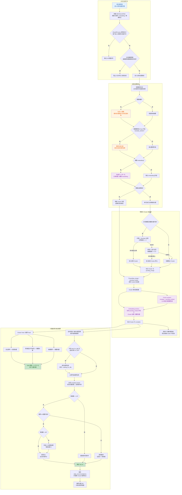

# MavenRSS

<p>
   <a href="README.md">English</a> | <strong>简体中文</strong>
</p>

## ✨ 功能特性

- 🌐 **网页与桌面端部署**：可选择原生桌面应用（Windows/macOS/Linux）或支持多用户访问的自托管网页服务器
- 🔐 **用户身份认证**：安全的登录/注册系统，基于 JWT 身份认证，支持多租户
- 🌍 **自动翻译与摘要**：自动翻译文章标题与正文，并生成简洁的内容摘要，助你快速获取信息
- 🤖 **AI 增强功能**：集成先进 AI 技术，赋能翻译、摘要、推荐等多种功能，让阅读更智能
- 🔌 **丰富的插件生态**：支持 Obsidian、Notion、FreshRSS、RSSHub 等主流工具集成，轻松扩展功能
- 📡 **多样化订阅方式**：支持 URL、XPath、脚本、Newsletter 等多种订阅源类型，满足不同需求
- 🏭 **自定义脚本与自动化**：内置过滤器与脚本系统，支持高度自定义的自动化流程
- 📱 **移动端友好**：响应式设计，针对移动设备优化，加载更快，用户体验更流畅

## 🧠 AI 增强模式

AI 增强模式会把 MavenRSS 从“订阅阅读器”升级成“AI 阅读助手”。文章抓取后，系统可以合并相似内容为文章簇、随着阅读行为持续优化推荐结果，并且每日根据大模型多维度打分生成 Top-10 推荐文章。最终效果是：更快读懂文章、更少被重复信息打扰，也更容易看到真正符合自己兴趣的内容。

### 核心 AI 特性

- **文章去重与聚类**：借助 **SimHash** 和 **sqlite-vec**，系统会把相似文章归并到同一个 **Cluster** 中，减少重复阅读，让持续追踪同一话题更轻松。
- **基于用户兴趣的文章排序**：系统会根据点击、深度阅读与收藏行为持续更新用户兴趣向量。
- **AI 每日推荐**：每日推荐并不只依赖向量相似度，而是先对候选摘要进行分组锦标赛筛选，再对全文做多维度评分，最终选出Top 10。
- **自动化 AI 工作流**：启用后，新内容可以自动经过摘要、翻译、embedding、聚类、融合、重排序、每日推荐调度等环节，尽量减少手动操作。

### 架构流程



## 🚀 快速开始

### 选择运行方式

#### 方案 1：使用 Docker 运行服务端模式

仓库内已经包含 `docker-compose.yml` 和服务端 Dockerfile，本地体验 Web 版最直接的方式是：

```bash
docker compose up -d --build
```

启动后访问 `http://localhost:1234`。

服务端模式常用环境变量：

- `MRRSS_DEBUG`
- `MRRSS_JWT_SECRET`
- `MRRSS_ADMIN_USERNAME`
- `MRRSS_ADMIN_EMAIL`
- `MRRSS_ADMIN_PASSWORD`
- `MRRSS_TEMPLATE_USERNAME`
- `MRRSS_TEMPLATE_EMAIL`
- `MRRSS_TEMPLATE_PASSWORD`

如果你不想走 Compose，也可以直接构建服务端二进制：

```bash
task build:server
```

输出位于 `build/bin/`，文件名会根据平台变成 `MavenRSS-server` 或 `MavenRSS-server.exe`。

#### 方案 2：从源码构建

<details>

<summary>点击展开源码构建指南</summary>

<div markdown="1">

### 前置要求

当前仓库实际围绕以下环境配置：

- [Go](https://go.dev/) 1.25+（`go.mod` 当前为 Go 1.25.0，toolchain 1.25.6）
- [Node.js](https://nodejs.org/) LTS + npm（`18+` 基本可用，推荐 `20/22`）
- [Wails v3 CLI](https://v3alpha.wails.io/getting-started/installation/)

平台说明：

- **Linux**：安装 `gcc` 或 `clang`、`pkg-config`、`libgtk-3-dev`、`libwebkit2gtk-4.1-dev`、`libsoup-3.0-dev`
- **Windows**：原生 CGO 构建建议使用 Zig 或 MinGW-w64；只有在需要打安装包时才需要 NSIS
- **macOS**：安装 Xcode Command Line Tools

详细说明见 [构建要求](docs/BUILD_REQUIREMENTS.md)。

```bash
# Ubuntu 24.04+ 示例
sudo apt-get install libgtk-3-dev libwebkit2gtk-4.1-dev libsoup-3.0-dev gcc pkg-config
```

### 安装步骤

1. 克隆仓库：
   ```bash
   git clone https://github.com/TdRoseval/MavenRSS.git
   cd MavenRSS
   ```
2. 安装后端与前端依赖：
   ```bash
   go mod download
   cd frontend
   npm install
   cd ..
   ```
3. 安装 Wails CLI：
   ```bash
   go install github.com/wailsapp/wails/v3/cmd/wails3@latest
   ```
4. 构建桌面版：
   ```bash
   # 已安装 Task 时，推荐使用
   task build

   # Makefile 包装命令
   make build

   # 直接调用 Wails，并使用仓库内配置
   wails3 build -config ./build/config.yml
   ```
5. 构建产物会输出到 `build/bin/`。

</div>

</details>

### 数据存储

<details>

<summary>点击展开数据存储说明</summary>

<div markdown="1">

**桌面应用：**

- **正常模式**（默认）：
  - **Windows:** `%APPDATA%\MavenRSS\` (例如 `C:\Users\YourName\AppData\Roaming\MavenRSS\`)
  - **macOS:** `~/Library/Application Support/MavenRSS/`
  - **Linux:** `~/.local/share/MavenRSS/`
- **便携模式**（当 `portable.txt` 文件存在时）：
  - 所有数据存储在 `data/` 文件夹中

**网页服务器：**

- 所有数据存储在 Docker 卷或配置的数据目录中

这确保了您的数据在应用更新和重新安装时得以保留。

</div>

</details>

## 🛠️ 开发指南

<details>

<summary>点击展开开发指南</summary>

<div markdown="1">

### 以开发模式运行桌面版

仓库当前默认的开发入口是：

```bash
task dev
```

它实际执行的是 `wails3 dev -config ./build/config.yml`，并会打开调试模式 `MRRSS_DEBUG=1`。

如果你想直接使用 Wails 命令：

```bash
wails3 dev -config ./build/config.yml
```

### 常用构建命令

```bash
# 查看 Task 任务
task --list

# 构建桌面版
task build

# 打包安装包 / Bundle
task package

# 构建服务端二进制
task build:server

# 构建本地服务端 Docker 镜像
task docker:build:server
```

仓库也提供了 `make` 作为常用流程包装：

```bash
make help
make build
make test
make check
make setup
make clean
```

### 前端常用命令

```bash
cd frontend
npm run dev
npm run lint
npm run test:unit
npm run test:e2e
npm run format
```

### 质量检查与发布前校验

`scripts/` 目录下提供了跨平台脚本：

```bash
# Linux / macOS
./scripts/check.sh
./scripts/pre-release.sh
```

```powershell
# Windows PowerShell
.\scripts\check.ps1
.\scripts\pre-release.ps1
```

### Pre-commit Hooks

```bash
pre-commit install
pre-commit run --all-files
```

</div>

</details>

## 📝 许可证

本项目采用 GPL-3.0 许可证 - 详情请参阅 [LICENSE](LICENSE) 文件。

***

<div align="center">
  <p>Made by AI</p>
  <p>⭐ 如果您觉得这个项目有用，请在 GitHub 上给我们点星！</p>
</div>
