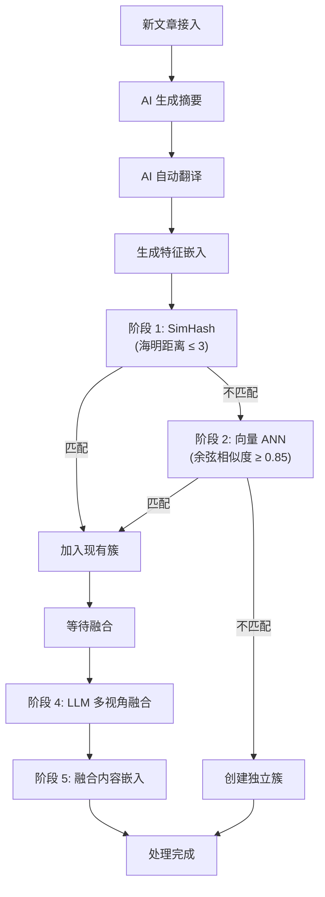

# MavenRSS (fork from [MrRSS](https://github.com/WCY-dt/MrRSS))


<p>
   <a href="README.md">English</a> | <strong>简体中文</strong>
</p>

[](https://github.com/WCY-dt/MavenRSS/releases)
[](LICENSE)
[](https://go.dev/)
[](https://wails.io/)
[](https://vuejs.org/)

## ✨ 功能特性

- 🌐 **网页与桌面端部署**：可选择原生桌面应用（Windows/macOS/Linux）或支持多用户访问的自托管网页服务器
- 🔐 **用户身份认证**：安全的登录/注册系统，基于 JWT 身份认证，支持多租户
- 🌍 **自动翻译与摘要**：自动翻译文章标题与正文，并生成简洁的内容摘要，助你快速获取信息
- 🤖 **AI 增强功能**：集成先进 AI 技术，赋能翻译、摘要、推荐等多种功能，让阅读更智能
- 🔌 **丰富的插件生态**：支持 Obsidian、Notion、FreshRSS、RSSHub 等主流工具集成，轻松扩展功能
- 📡 **多样化订阅方式**：支持 URL、XPath、脚本、Newsletter 等多种订阅源类型，满足不同需求
- 🏭 **自定义脚本与自动化**：内置过滤器与脚本系统，支持高度自定义的自动化流程
- 📱 **移动端友好**：响应式设计，针对移动设备优化，加载更快，用户体验更流畅

## 🧠 AI 增强引擎

MavenRSS 拥有强大的 AI 处理管道，能够自动对相关文章进行去重、聚类和融合，为您提供更清爽、更深入的阅读体验。

### 核心 AI 特性

- **全局文章去重**：采用先进的两阶段去重流程，结合 **SimHash**（字面相似度）和 **向量嵌入 Embeddings**（基于 `sqlite-vec` 的语义相似度）。
- **AI 视点融合 (文章簇)**：自动将不同订阅源的相关文章归拢至“文章簇 (Cluster)”中，并利用大模型 (LLM) 合成包含多方视角的“超级文章”。
- **自动翻译与摘要**：在特征嵌入前自动过滤、翻译并生成文章摘要，以丰富语义上下文。
- **隐私优先**：向量嵌入与聚类计算完全在本地利用 SQLite 向量检索完成，无需依赖外部云端向量数据库。

### 架构流程




## 🚀 快速开始

### 部署选项

MavenRSS 提供三种部署方式：

#### 选项 1：桌面应用（个人使用推荐）

从上游仓库的 [Releases](https://github.com/WCY-dt/MrRSS/releases/latest) 页面下载适合您平台的最新安装包。


#### 选项 2：网页服务器（团队/共享使用推荐）

将 MavenRSS 部署为网页服务器，支持多用户访问。

##### 使用 Docker（推荐）

```bash
# 使用 Docker Compose 启动
docker-compose up -d

# 或直接使用 Docker
docker run -d -p 1234:1234 \
  -v mavenrss-data:/app/data \
  --name mavenrss-server \
  ghcr.io/tdroseval/mavenrss:latest
```

在 `http://localhost:1234` 访问网页界面

##### 配置

以下环境变量可用于配置：

- `MRRSS_JWT_SECRET`：JWT 令牌的密钥（生产环境必需）
- `MRRSS_ADMIN_USERNAME`：管理员用户名
- `MRRSS_ADMIN_EMAIL`：管理员邮箱
- `MRRSS_ADMIN_PASSWORD`：管理员密码
- `MRRSS_TEMPLATE_USERNAME`：模板用户用户名
- `MRRSS_TEMPLATE_EMAIL`：模板用户邮箱
- `MRRSS_TEMPLATE_PASSWORD`：模板用户密码


#### 选项 3：从源码构建（桌面版）

<details>

<summary>点击展开源码构建指南</summary>

<div markdown="1">

##### 前置要求

在开始之前，请确保已安装以下环境：

- [Go](https://go.dev/) (1.25 或更高版本)
- [Node.js](https://nodejs.org/) (20 LTS 或更高版本，带 npm)
- [Wails v3](https://v3alpha.wails.io/getting-started/installation/) CLI

**平台特定要求：**

- **Linux**: GTK3、WebKit2GTK 4.1、libsoup 3.0、GCC、pkg-config
- **Windows**: MinGW-w64（用于 CGO 支持）、NSIS（用于安装包）
- **macOS**: Xcode 命令行工具

详细安装说明请参见[构建要求](docs/BUILD_REQUIREMENTS.md)

```bash
# Linux 快速设置（Ubuntu 24.04+）：
sudo apt-get install libgtk-3-dev libwebkit2gtk-4.1-dev libsoup-3.0-dev gcc pkg-config
```

##### 安装步骤

1. **克隆仓库**

   ```bash
   git clone https://github.com/TdRoseval/MavenRSS.git
   cd MavenRSS
   ```

2. **安装前端依赖**

   ```bash
   cd frontend
   npm install
   cd ..
   ```

3. **安装 Wails v3 CLI**

   ```bash
   go install github.com/wailsapp/wails/v3/cmd/wails3@latest
   ```

4. **构建应用**

   ```bash
   # 使用 Task（推荐）
   task build

   # 或使用 Makefile
   make build

   # 或直接使用 wails3
   wails3 build
   ```

   可执行文件将在 `build/bin` 目录下生成。

5. **运行应用**

   - Windows: `build/bin/MavenRSS.exe`
   - macOS: `build/bin/MavenRSS.app`
   - Linux: `build/bin/MavenRSS`

</div>

</details>

### 数据存储

<details>

<summary>点击展开数据存储说明</summary>

<div markdown="1">

**桌面应用：**

- **正常模式**（默认）：
  - **Windows:** `%APPDATA%\MavenRSS\` (例如 `C:\Users\YourName\AppData\Roaming\MavenRSS\`)
  - **macOS:** `~/Library/Application Support/MavenRSS/`
  - **Linux:** `~/.local/share/MavenRSS/`

- **便携模式**（当 `portable.txt` 文件存在时）：
  - 所有数据存储在 `data/` 文件夹中

**网页服务器：**
- 所有数据存储在 Docker 卷或配置的数据目录中

这确保了您的数据在应用更新和重新安装时得以保留。

</div>

</details>

## 🛠️ 开发指南

<details>

<summary>点击展开开发指南</summary>

<div markdown="1">

### 开发模式运行

启动带有热重载的应用：

```bash
# 使用 Wails v3
wails3 dev

# 或使用 Task
task dev
```

### 代码质量工具

#### 使用 Make

我们提供了 `Makefile` 来处理常见的开发任务（在 Linux/macOS/Windows 上都可用）：

```bash
# 显示所有可用命令
make help

# 运行完整检查（lint + 测试 + 构建）
make check

# 清理构建产物
make clean

# 设置开发环境
make setup
```

### Pre-commit Hooks

本项目使用 pre-commit hooks 来确保代码质量：

```bash
# 安装 hooks
pre-commit install

# 在所有文件上运行
pre-commit run --all-files
```

### 运行测试

```bash
make test
```

</div>

</details>

## 📝 许可证

本项目采用 GPL-3.0 许可证 - 详情请参阅 [LICENSE](LICENSE) 文件。

---

<div align="center">
  <p>Made by AI</p>
  <p>⭐ 如果您觉得这个项目有用，请在 GitHub 上给我们点星！</p>
</div>
