# MrRSS 后端重构计划

> **最后更新**: 2026-01-30
> **状态**: 计划中
> **相关文档**: [ARCHITECTURE.md](ARCHITECTURE.md) | [CODE_PATTERNS.md](CODE_PATTERNS.md)

## 目录

- [一、概述](#一概述)
- [二、重构计划（分阶段执行）](#二重构计划分阶段执行)
- [三、重构优先级和时间估算](#三重构优先级和时间估算)
- [四、建议的执行顺序](#四建议的执行顺序)
- [五、注意事项](#五注意事项)
- [六、进度追踪](#六进度追踪)

---

## 一、概述

经过对整个后端代码的全面审查，发现当前代码虽然功能完善，但存在以下主要问题需要重构。

### 1.1 主要问题

#### 问题1：main.go 和 main-core.go 代码重复严重

两个入口文件有约 **70%** 的代码是重复的，主要是路由定义完全相同。

**当前状态**：
- `main.go` (770行) - 桌面应用入口
- `main-core.go` (383行) - 服务器模式入口
- 路由定义在两个文件中各出现一次，约 100+ 行完全重复

#### 问题2：Handler 耦合度过高

`core.Handler` 持有太多依赖，几乎成为"上帝对象"：

```go
type Handler struct {
    DB               *database.DB
    Fetcher          *feed.Fetcher
    Translator       translation.Translator
    AITracker        *aiusage.Tracker
    DiscoveryService *discovery.Service
    App              interface{}
    ContentCache     *cache.ContentCache
    Stats            *statistics.Service
    // Discovery state tracking
    DiscoveryMu          sync.RWMutex
    SingleDiscoveryState *DiscoveryState
    BatchDiscoveryState  *DiscoveryState
}
```

#### 问题3：数据库层职责不清

- `database/db.go` (627行) - schema、迁移、初始化、缓存操作混在一起
- `database/article_db.go` (924行) - 单个文件过大，职责过多

#### 问题4：某些文件过大

| 文件 | 行数 | 问题 |
|------|------|------|
| `settings_handlers.go` | 945 | 生成代码结构冗余 |
| `article_db.go` | 924 | 需要拆分 |
| `freshrss/client.go` | 757 | 功能太杂 |
| `db.go` | 627 | 职责混合 |
| `feed_db.go` | 571 | 可以拆分 |
| `article_db_sync.go` | 550 | 可以优化 |

#### 问题5：缺乏一致的错误处理

- 错误处理方式不统一（有些用 `http.Error`，有些用 JSON 响应）
- 缺少错误分类和错误码
- 客户端难以区分不同类型的错误

#### 问题6：缺少接口抽象

- 很多模块直接依赖具体实现，难以进行单元测试
- Mock 困难，需要启动真实数据库才能测试

### 1.2 重构目标

- ✅ **消除代码重复**：统一路由注册，减少维护成本
- ✅ **降低模块耦合度**：引入服务层和接口抽象
- ✅ **提高代码可测试性**：依赖注入，接口抽象
- ✅ **统一错误处理**：一致的错误响应格式
- ✅ **改善代码组织结构**：拆分大文件，明确职责
- ✅ **保持向后兼容**：API 端点、数据库结构、配置格式不变

### 1.3 代码统计

当前后端代码分布（按行数排序，仅非测试文件）：

```
internal/handlers/settings/settings_handlers.go      945
internal/database/article_db.go                      924
internal/freshrss/client.go                          757
internal/database/db.go                              627
internal/database/feed_db.go                         571
internal/database/article_db_sync.go                 550
internal/handlers/opml/opml_handlers.go              516
internal/rules/engine.go                             495
internal/feed/fetcher.go                             486
internal/handlers/article/article_bulk.go            448
internal/database/cleanup_db.go                      448
internal/handlers/feed/feed_handlers.go              434
internal/handlers/translation/translation_handlers.go 425
internal/cache/media_cache.go                        422
internal/feed/article_processor.go                   419
```

---

## 二、重构计划（分阶段执行）

### 阶段1：统一路由注册，消除入口文件重复

**目标**：提取 `main.go` 和 `main-core.go` 中重复的路由定义

**当前问题**：

```go
// main.go 中的路由定义 (约100行)
apiMux.HandleFunc("/api/feeds", func(w http.ResponseWriter, r *http.Request) { feedhandlers.HandleFeeds(h, w, r) })
apiMux.HandleFunc("/api/feeds/add", func(w http.ResponseWriter, r *http.Request) { feedhandlers.HandleAddFeed(h, w, r) })
// ... 70+ 更多路由

// main-core.go 中完全相同的定义 (约100行)
apiMux.HandleFunc("/api/feeds", func(w http.ResponseWriter, r *http.Request) { feedhandlers.HandleFeeds(h, w, r) })
apiMux.HandleFunc("/api/feeds/add", func(w http.ResponseWriter, r *http.Request) { feedhandlers.HandleAddFeed(h, w, r) })
// ... 70+ 更多路由
```

**解决方案**：

#### 1.1 创建路由注册模块

```go
// internal/routes/routes.go
package routes

import (
    "net/http"

    "MrRSS/internal/handlers/core"
    // ... 其他 handler 包导入
)

// RegisterAPIRoutes 注册所有 API 路由
// 此函数由 main.go 和 main-core.go 共同调用
func RegisterAPIRoutes(mux *http.ServeMux, h *core.Handler) {
    // Feed routes
    mux.HandleFunc("/api/feeds", func(w http.ResponseWriter, r *http.Request) {
        feedhandlers.HandleFeeds(h, w, r)
    })
    mux.HandleFunc("/api/feeds/add", func(w http.ResponseWriter, r *http.Request) {
        feedhandlers.HandleAddFeed(h, w, r)
    })
    // ... 所有其他路由
}
```

#### 1.2 按功能域分组路由

```go
// internal/routes/feed_routes.go
func registerFeedRoutes(mux *http.ServeMux, h *core.Handler) {
    mux.HandleFunc("/api/feeds", ...)
    mux.HandleFunc("/api/feeds/add", ...)
    mux.HandleFunc("/api/feeds/delete", ...)
    // ...
}

// internal/routes/article_routes.go
func registerArticleRoutes(mux *http.ServeMux, h *core.Handler) {
    mux.HandleFunc("/api/articles", ...)
    mux.HandleFunc("/api/articles/read", ...)
    // ...
}

// internal/routes/routes.go
func RegisterAPIRoutes(mux *http.ServeMux, h *core.Handler) {
    registerFeedRoutes(mux, h)
    registerArticleRoutes(mux, h)
    registerSettingsRoutes(mux, h)
    registerDiscoveryRoutes(mux, h)
    registerAIRoutes(mux, h)
    // ...
}
```

#### 1.3 简化入口文件

```go
// main.go (简化后)
func main() {
    // ... 初始化代码

    apiMux := http.NewServeMux()
    routes.RegisterAPIRoutes(apiMux, h)  // 一行搞定所有路由

    // ... Wails 特有配置
}

// main-core.go (简化后)
func main() {
    // ... 初始化代码

    apiMux := http.NewServeMux()
    routes.RegisterAPIRoutes(apiMux, h)  // 一行搞定所有路由

    // Swagger 路由 (仅服务器模式)
    apiMux.HandleFunc("/swagger/*", httpSwagger.Handler(...))

    // ... HTTP 服务器配置
}
```

**预计变更文件**：

| 操作 | 文件 | 说明 |
|------|------|------|
| 新增 | `internal/routes/routes.go` | 主路由注册入口 |
| 新增 | `internal/routes/feed_routes.go` | Feed 相关路由 |
| 新增 | `internal/routes/article_routes.go` | Article 相关路由 |
| 新增 | `internal/routes/settings_routes.go` | Settings 相关路由 |
| 新增 | `internal/routes/discovery_routes.go` | Discovery 相关路由 |
| 新增 | `internal/routes/ai_routes.go` | AI 相关路由 |
| 修改 | `main.go` | 减少约 200 行 |
| 修改 | `main-core.go` | 减少约 180 行 |

**风险评估**：⭐ 低风险 - 纯代码组织重构，不改变任何业务逻辑

---

### 阶段2：重构 Handler 架构

**目标**：将 `core.Handler` 拆分为更小的服务层，引入依赖注入

**当前问题**：

Handler 是一个"上帝对象"，持有所有依赖：

```go
// 当前的 Handler 结构
type Handler struct {
    DB               *database.DB        // 数据库
    Fetcher          *feed.Fetcher       // Feed 获取器
    Translator       translation.Translator  // 翻译器
    AITracker        *aiusage.Tracker    // AI 使用追踪
    DiscoveryService *discovery.Service  // 发现服务
    App              interface{}         // Wails 应用实例
    ContentCache     *cache.ContentCache // 内容缓存
    Stats            *statistics.Service // 统计服务
    // ... 更多状态
}
```

**问题**：
1. 测试困难 - 需要 mock 所有依赖
2. 职责不清 - Handler 知道太多事情
3. 扩展困难 - 添加新功能需要修改 Handler

**解决方案**：

#### 2.1 定义服务接口

```go
// internal/service/interfaces.go
package service

import (
    "context"
    "MrRSS/internal/models"
)

// ArticleService 定义文章相关操作
type ArticleService interface {
    GetArticles(ctx context.Context, opts ArticleQueryOptions) ([]models.Article, error)
    GetArticleByID(ctx context.Context, id int64) (*models.Article, error)
    MarkRead(ctx context.Context, id int64, read bool) error
    MarkFavorite(ctx context.Context, id int64, favorite bool) error
    GetContent(ctx context.Context, id int64) (string, error)
    Summarize(ctx context.Context, id int64) (string, error)
}

// FeedService 定义订阅源相关操作
type FeedService interface {
    GetFeeds(ctx context.Context) ([]models.Feed, error)
    GetFeedByID(ctx context.Context, id int64) (*models.Feed, error)
    AddFeed(ctx context.Context, feed *models.Feed) (int64, error)
    UpdateFeed(ctx context.Context, feed *models.Feed) error
    DeleteFeed(ctx context.Context, id int64) error
    RefreshFeed(ctx context.Context, id int64) error
    RefreshAll(ctx context.Context) error
}

// TranslationService 定义翻译相关操作
type TranslationService interface {
    Translate(ctx context.Context, text, targetLang string) (string, error)
    TranslateArticle(ctx context.Context, articleID int64, targetLang string) error
}

// AIService 定义 AI 相关操作
type AIService interface {
    Summarize(ctx context.Context, content string) (string, error)
    Chat(ctx context.Context, sessionID int64, message string) (string, error)
    Search(ctx context.Context, query string) ([]models.Article, error)
}

// DiscoveryService 定义发现相关操作
type DiscoveryService interface {
    DiscoverFromURL(ctx context.Context, url string) ([]DiscoveredFeed, error)
    DiscoverFromBatch(ctx context.Context, urls []string) ([]DiscoveredFeed, error)
    GetProgress() DiscoveryProgress
}

// SettingsService 定义设置相关操作
type SettingsService interface {
    Get(key string) (string, error)
    Set(key, value string) error
    GetEncrypted(key string) (string, error)
    SetEncrypted(key, value string) error
    GetAll() (map[string]string, error)
    SaveAll(settings map[string]string) error
}
```

#### 2.2 创建服务注册中心

```go
// internal/service/registry.go
package service

import (
    "sync"

    "MrRSS/internal/database"
)

// Registry 是所有服务的注册中心
type Registry struct {
    db       *database.DB
    services sync.Map

    // 懒加载的服务实例
    articleSvc     ArticleService
    feedSvc        FeedService
    translationSvc TranslationService
    aiSvc          AIService
    discoverySvc   DiscoveryService
    settingsSvc    SettingsService

    initOnce sync.Once
}

// NewRegistry 创建新的服务注册中心
func NewRegistry(db *database.DB) *Registry {
    return &Registry{db: db}
}

// Article 返回文章服务
func (r *Registry) Article() ArticleService {
    r.initOnce.Do(r.initialize)
    return r.articleSvc
}

// Feed 返回订阅源服务
func (r *Registry) Feed() FeedService {
    r.initOnce.Do(r.initialize)
    return r.feedSvc
}

// Translation 返回翻译服务
func (r *Registry) Translation() TranslationService {
    r.initOnce.Do(r.initialize)
    return r.translationSvc
}

// AI 返回 AI 服务
func (r *Registry) AI() AIService {
    r.initOnce.Do(r.initialize)
    return r.aiSvc
}

// Discovery 返回发现服务
func (r *Registry) Discovery() DiscoveryService {
    r.initOnce.Do(r.initialize)
    return r.discoverySvc
}

// Settings 返回设置服务
func (r *Registry) Settings() SettingsService {
    r.initOnce.Do(r.initialize)
    return r.settingsSvc
}

func (r *Registry) initialize() {
    // 初始化所有服务
    r.settingsSvc = NewSettingsService(r.db)
    r.articleSvc = NewArticleService(r.db, r.settingsSvc)
    r.feedSvc = NewFeedService(r.db, r.settingsSvc)
    r.translationSvc = NewTranslationService(r.db, r.settingsSvc)
    r.aiSvc = NewAIService(r.db, r.settingsSvc)
    r.discoverySvc = NewDiscoveryServiceImpl()
}
```

#### 2.3 实现具体服务

```go
// internal/service/article_service.go
package service

type articleService struct {
    db       *database.DB
    settings SettingsService
}

func NewArticleService(db *database.DB, settings SettingsService) ArticleService {
    return &articleService{db: db, settings: settings}
}

func (s *articleService) GetArticles(ctx context.Context, opts ArticleQueryOptions) ([]models.Article, error) {
    // 从数据库获取文章
    return s.db.GetArticles(opts.Filter, opts.FeedID, opts.Category, opts.ShowHidden, opts.Limit, opts.Offset)
}

// ... 其他方法实现
```

#### 2.4 简化 Handler

```go
// internal/handlers/core/handler.go (重构后)
package core

import (
    "MrRSS/internal/service"
)

// Handler 现在只是服务的容器
type Handler struct {
    Services *service.Registry
    App      interface{} // Wails 应用实例（仅桌面模式）
}

// NewHandler 创建新的 Handler
func NewHandler(services *service.Registry) *Handler {
    return &Handler{Services: services}
}

// 为了向后兼容，保留一些便捷方法
func (h *Handler) DB() *database.DB {
    return h.Services.DB()
}
```

#### 2.5 更新 Handler 使用方式

```go
// 重构前
func HandleArticles(h *core.Handler, w http.ResponseWriter, r *http.Request) {
    articles, err := h.DB.GetArticles(filter, feedID, category, showHidden, limit, offset)
    // ...
}

// 重构后
func HandleArticles(h *core.Handler, w http.ResponseWriter, r *http.Request) {
    articles, err := h.Services.Article().GetArticles(r.Context(), service.ArticleQueryOptions{
        Filter:     filter,
        FeedID:     feedID,
        Category:   category,
        ShowHidden: showHidden,
        Limit:      limit,
        Offset:     offset,
    })
    // ...
}
```

**预计变更文件**：

| 操作 | 文件 | 说明 |
|------|------|------|
| 新增 | `internal/service/interfaces.go` | 服务接口定义 |
| 新增 | `internal/service/registry.go` | 服务注册中心 |
| 新增 | `internal/service/article_service.go` | 文章服务实现 |
| 新增 | `internal/service/feed_service.go` | 订阅源服务实现 |
| 新增 | `internal/service/translation_service.go` | 翻译服务实现 |
| 新增 | `internal/service/ai_service.go` | AI 服务实现 |
| 新增 | `internal/service/discovery_service.go` | 发现服务实现 |
| 新增 | `internal/service/settings_service.go` | 设置服务实现 |
| 修改 | `internal/handlers/core/handler.go` | 简化为服务容器 |
| 修改 | `main.go` | 使用新的初始化方式 |
| 修改 | `main-core.go` | 使用新的初始化方式 |

**风险评估**：⭐⭐⭐ 中等风险 - 需要仔细测试所有功能

---

### 阶段3：重构数据库层

**目标**：拆分臃肿的数据库文件，分离职责，提高可维护性

**当前问题**：

1. `database/db.go` (627行) 包含：
   - 数据库连接管理
   - Schema 定义
   - 迁移逻辑
   - 初始化逻辑
   - 翻译缓存操作

2. `database/article_db.go` (924行) 包含：
   - 基本 CRUD
   - 复杂查询
   - 批量操作
   - 统计计算

**解决方案**：

#### 3.1 拆分 db.go

```
internal/database/
├── db.go              # 连接管理（~100行）
├── schema.go          # 表结构定义（~150行）
├── migrations.go      # 迁移逻辑（~200行）
├── init.go            # 初始化逻辑（~100行）
└── cache_db.go        # 缓存相关操作（~80行）
```

#### 3.2 拆分 article_db.go

```
internal/database/
├── article_db.go          # 基本 CRUD (~200行)
├── article_query_db.go    # 复杂查询 (~300行)
├── article_batch_db.go    # 批量操作 (~200行)
└── article_sync_db.go     # 同步相关 (已存在)
```

#### 3.3 创建 Repository 接口

```go
// internal/database/repository.go
package database

import (
    "context"
    "MrRSS/internal/models"
)

// ArticleRepository 定义文章数据访问接口
type ArticleRepository interface {
    // 基本 CRUD
    Save(ctx context.Context, article *models.Article) error
    SaveBatch(ctx context.Context, articles []*models.Article) error
    GetByID(id int64) (*models.Article, error)
    Delete(id int64) error

    // 查询
    Query(opts QueryOptions) ([]models.Article, error)
    Count(opts QueryOptions) (int64, error)

    // 状态更新
    MarkRead(id int64, read bool) error
    MarkFavorite(id int64, favorite bool) error
    MarkHidden(id int64, hidden bool) error
}

// FeedRepository 定义订阅源数据访问接口
type FeedRepository interface {
    Save(feed *models.Feed) (int64, error)
    GetByID(id int64) (*models.Feed, error)
    GetAll() ([]models.Feed, error)
    Delete(id int64) error
    UpdateError(id int64, errMsg string) error
}

// SettingsRepository 定义设置数据访问接口
type SettingsRepository interface {
    Get(key string) (string, error)
    Set(key, value string) error
    GetEncrypted(key string) (string, error)
    SetEncrypted(key, value string) error
}
```

**预计变更文件**：

| 操作 | 文件 | 说明 |
|------|------|------|
| 新增 | `internal/database/schema.go` | 表结构定义 |
| 新增 | `internal/database/migrations.go` | 迁移逻辑 |
| 新增 | `internal/database/init.go` | 初始化逻辑 |
| 新增 | `internal/database/repository.go` | 接口定义 |
| 新增 | `internal/database/article_query_db.go` | 复杂查询 |
| 新增 | `internal/database/article_batch_db.go` | 批量操作 |
| 修改 | `internal/database/db.go` | 减少约 400 行 |
| 修改 | `internal/database/article_db.go` | 减少约 500 行 |

**风险评估**：⭐⭐⭐⭐ 高风险 - 数据库层是核心，需要完整的测试覆盖

---

### 阶段4：统一错误处理

**目标**：创建一致的错误处理机制，提高用户体验和调试效率

**当前问题**：

```go
// 方式1: 直接返回错误文本
http.Error(w, "Invalid request body", http.StatusBadRequest)

// 方式2: 返回 JSON 错误
json.NewEncoder(w).Encode(map[string]string{"error": err.Error()})

// 方式3: 返回详细错误信息
http.Error(w, fmt.Sprintf("Failed to get articles: %v", err), http.StatusInternalServerError)
```

**解决方案**：

#### 4.1 定义错误类型

```go
// internal/errors/errors.go
package errors

// ErrorCode 定义错误码
type ErrorCode string

const (
    ErrCodeNotFound     ErrorCode = "NOT_FOUND"
    ErrCodeInvalidInput ErrorCode = "INVALID_INPUT"
    ErrCodeDBError      ErrorCode = "DB_ERROR"
    ErrCodeUnauthorized ErrorCode = "UNAUTHORIZED"
    ErrCodeForbidden    ErrorCode = "FORBIDDEN"
    ErrCodeConflict     ErrorCode = "CONFLICT"
    ErrCodeInternal     ErrorCode = "INTERNAL_ERROR"
    ErrCodeTimeout      ErrorCode = "TIMEOUT"
    ErrCodeRateLimit    ErrorCode = "RATE_LIMIT"
)

// AppError 表示应用级错误
type AppError struct {
    Code    ErrorCode `json:"code"`
    Message string    `json:"message"`
    Detail  string    `json:"detail,omitempty"`
    Cause   error     `json:"-"`
}

func (e *AppError) Error() string {
    if e.Cause != nil {
        return fmt.Sprintf("%s: %s (%v)", e.Code, e.Message, e.Cause)
    }
    return fmt.Sprintf("%s: %s", e.Code, e.Message)
}

// 预定义错误
var (
    ErrNotFound      = &AppError{Code: ErrCodeNotFound, Message: "Resource not found"}
    ErrInvalidInput  = &AppError{Code: ErrCodeInvalidInput, Message: "Invalid input"}
    ErrDBError       = &AppError{Code: ErrCodeDBError, Message: "Database error"}
    ErrUnauthorized  = &AppError{Code: ErrCodeUnauthorized, Message: "Unauthorized"}
    ErrInternal      = &AppError{Code: ErrCodeInternal, Message: "Internal server error"}
)

// Wrap 包装错误
func Wrap(err error, code ErrorCode, message string) *AppError {
    return &AppError{Code: code, Message: message, Cause: err}
}

// WrapNotFound 包装 Not Found 错误
func WrapNotFound(resource string) *AppError {
    return &AppError{Code: ErrCodeNotFound, Message: fmt.Sprintf("%s not found", resource)}
}
```

#### 4.2 创建统一响应助手

```go
// internal/handlers/response/response.go
package response

import (
    "encoding/json"
    "net/http"

    "MrRSS/internal/errors"
)

// APIResponse 统一响应格式
type APIResponse struct {
    Success bool        `json:"success"`
    Data    interface{} `json:"data,omitempty"`
    Error   *ErrorInfo  `json:"error,omitempty"`
}

type ErrorInfo struct {
    Code    string `json:"code"`
    Message string `json:"message"`
    Detail  string `json:"detail,omitempty"`
}

// JSON 返回成功的 JSON 响应
func JSON(w http.ResponseWriter, data interface{}) {
    w.Header().Set("Content-Type", "application/json")
    json.NewEncoder(w).Encode(APIResponse{Success: true, Data: data})
}

// Error 返回错误响应
func Error(w http.ResponseWriter, err error) {
    w.Header().Set("Content-Type", "application/json")

    var appErr *errors.AppError
    if e, ok := err.(*errors.AppError); ok {
        appErr = e
    } else {
        appErr = errors.Wrap(err, errors.ErrCodeInternal, "An error occurred")
    }

    status := errorToStatus(appErr.Code)
    w.WriteHeader(status)
    json.NewEncoder(w).Encode(APIResponse{
        Success: false,
        Error: &ErrorInfo{
            Code:    string(appErr.Code),
            Message: appErr.Message,
            Detail:  appErr.Detail,
        },
    })
}

func errorToStatus(code errors.ErrorCode) int {
    switch code {
    case errors.ErrCodeNotFound:
        return http.StatusNotFound
    case errors.ErrCodeInvalidInput:
        return http.StatusBadRequest
    case errors.ErrCodeUnauthorized:
        return http.StatusUnauthorized
    case errors.ErrCodeForbidden:
        return http.StatusForbidden
    default:
        return http.StatusInternalServerError
    }
}
```

**预计变更文件**：

| 操作 | 文件 | 说明 |
|------|------|------|
| 新增 | `internal/errors/errors.go` | 错误类型定义 |
| 新增 | `internal/handlers/response/response.go` | 响应助手 |
| 修改 | 所有 handler 文件 | 逐步迁移到新的错误处理 |

**风险评估**：⭐⭐ 低风险 - 可以逐步迁移，不需要一次性修改

---

### 阶段5：翻译模块重构

**目标**：统一翻译服务接口，便于添加新的翻译提供商

**当前问题**：

- 翻译服务分散在多个文件中
- `dynamic.go` 中的服务选择逻辑复杂
- 缺少统一的接口定义

**解决方案**：

#### 5.1 定义翻译接口

```go
// internal/translation/interface.go
package translation

import "context"

// TranslationResult 翻译结果
type TranslationResult struct {
    Original   string
    Translated string
    FromLang   string
    ToLang     string
    Provider   string
}

// Provider 翻译提供商接口
type Provider interface {
    // Name 返回提供商名称
    Name() string

    // Translate 执行翻译
    Translate(ctx context.Context, text, from, to string) (*TranslationResult, error)

    // IsAvailable 检查提供商是否可用
    IsAvailable() bool

    // SupportedLanguages 返回支持的语言列表
    SupportedLanguages() []string
}

// ProviderConfig 提供商配置
type ProviderConfig struct {
    APIKey    string
    Endpoint  string
    Model     string
    RateLimit int
}
```

#### 5.2 创建提供商工厂

```go
// internal/translation/factory.go
package translation

import "fmt"

// ProviderType 提供商类型
type ProviderType string

const (
    ProviderGoogle ProviderType = "google"
    ProviderDeepL  ProviderType = "deepl"
    ProviderBaidu  ProviderType = "baidu"
    ProviderAI     ProviderType = "ai"
)

// Factory 翻译提供商工厂
type Factory struct {
    configs map[ProviderType]ProviderConfig
}

// NewFactory 创建工厂实例
func NewFactory(configs map[ProviderType]ProviderConfig) *Factory {
    return &Factory{configs: configs}
}

// Create 创建提供商实例
func (f *Factory) Create(providerType ProviderType) (Provider, error) {
    config, exists := f.configs[providerType]
    if !exists {
        config = ProviderConfig{}
    }

    switch providerType {
    case ProviderGoogle:
        return NewGoogleProvider(config), nil
    case ProviderDeepL:
        return NewDeepLProvider(config), nil
    case ProviderBaidu:
        return NewBaiduProvider(config), nil
    case ProviderAI:
        return NewAIProvider(config), nil
    default:
        return nil, fmt.Errorf("unknown provider type: %s", providerType)
    }
}
```

**预计变更文件**：

| 操作 | 文件 | 说明 |
|------|------|------|
| 新增 | `internal/translation/interface.go` | 接口定义 |
| 新增 | `internal/translation/factory.go` | 工厂模式 |
| 修改 | `internal/translation/google.go` | 实现 Provider 接口 |
| 修改 | `internal/translation/deepl.go` | 实现 Provider 接口 |
| 修改 | `internal/translation/baidu.go` | 实现 Provider 接口 |
| 修改 | `internal/translation/ai.go` | 实现 Provider 接口 |
| 删除 | `internal/translation/dynamic.go` | 功能合并到工厂 |

**风险评估**：⭐⭐⭐ 中等风险 - 需要确保所有翻译功能正常

---

### 阶段6：Feed模块重构

**目标**：解耦 Feed 解析和获取逻辑，支持更多数据源类型

**当前问题**：

- `fetcher.go` 过大（631行），职责不清晰
- RSS 解析、HTTP 请求、脚本执行混在一起
- 难以添加新的数据源类型

**解决方案**：

#### 6.1 定义数据源接口

```go
// internal/feed/source/interface.go
package source

import (
    "context"
    "github.com/mmcdole/gofeed"
)

// Source 数据源接口
type Source interface {
    // Type 返回数据源类型
    Type() string

    // Fetch 获取 Feed 内容
    Fetch(ctx context.Context, config *FetchConfig) (*gofeed.Feed, error)

    // Validate 验证配置
    Validate(config *FetchConfig) error
}

// FetchConfig 获取配置
type FetchConfig struct {
    URL         string
    ScriptPath  string
    XPath       string
    ProxyURL    string
    Timeout     time.Duration
    Headers     map[string]string
    Credentials *Credentials
}

// Credentials 认证信息
type Credentials struct {
    Username string
    Password string
    APIKey   string
}
```

#### 6.2 实现各类型数据源

```go
// internal/feed/source/rss.go
type RSSSource struct {
    client *http.Client
    parser *gofeed.Parser
}

func (s *RSSSource) Type() string { return "rss" }

func (s *RSSSource) Fetch(ctx context.Context, config *FetchConfig) (*gofeed.Feed, error) {
    // HTTP 请求获取 RSS
}

// internal/feed/source/script.go
type ScriptSource struct {
    executor *ScriptExecutor
}

func (s *ScriptSource) Type() string { return "script" }

// internal/feed/source/xpath.go
type XPathSource struct {
    client *http.Client
    parser *XPathParser
}

func (s *XPathSource) Type() string { return "xpath" }
```

**预计变更文件**：

| 操作 | 文件 | 说明 |
|------|------|------|
| 新增 | `internal/feed/source/interface.go` | 接口定义 |
| 新增 | `internal/feed/source/rss.go` | RSS 数据源 |
| 新增 | `internal/feed/source/script.go` | 脚本数据源 |
| 新增 | `internal/feed/source/xpath.go` | XPath 数据源 |
| 修改 | `internal/feed/fetcher.go` | 使用数据源接口 |

**风险评估**：⭐⭐⭐ 中等风险 - Feed 是核心功能，需要充分测试

---

### 阶段7：AI模块整合

**目标**：整合 AI 相关功能，统一配置和使用方式

**当前问题**：

- AI 配置分散在 `internal/ai/` 和 `internal/aiusage/`
- 摘要生成和 AI 聊天功能重复定义 client 逻辑
- 缺少统一的 AI 服务层

**解决方案**：

```go
// internal/ai/service.go
package ai

import "context"

// Service AI 服务统一入口
type Service struct {
    client       *Client
    usageTracker *UsageTracker
    config       *Config
}

// NewService 创建 AI 服务
func NewService(config *Config) *Service {
    return &Service{
        client:       NewClient(config),
        usageTracker: NewUsageTracker(config.DailyLimit),
        config:       config,
    }
}

// Summarize 生成摘要
func (s *Service) Summarize(ctx context.Context, content string) (string, error) {
    if !s.usageTracker.CanUse() {
        return "", ErrDailyLimitReached
    }
    // ...
}

// Chat 聊天对话
func (s *Service) Chat(ctx context.Context, messages []Message) (string, error) {
    // ...
}

// Search 语义搜索
func (s *Service) Search(ctx context.Context, query string) ([]SearchResult, error) {
    // ...
}
```

**预计变更文件**：

| 操作 | 文件 | 说明 |
|------|------|------|
| 新增 | `internal/ai/service.go` | 统一服务层 |
| 修改 | `internal/ai/config.go` | 整合配置 |
| 合并 | `internal/aiusage/` | 合并到 `internal/ai/` |
| 修改 | `internal/summary/ai_summarizer.go` | 使用 AI Service |

**风险评估**：⭐⭐ 低风险 - AI 功能相对独立

---

### 阶段8：工具函数整理

**目标**：整理和标准化工具函数

**当前问题**：

- `internal/utils/` 包含混杂的工具函数
- 部分工具函数应该属于其他模块
- 缺少统一的命名规范

**解决方案**：

```plaintext
internal/utils/
├── file/           # 文件操作
│   ├── path.go     # 路径处理
│   └── io.go       # 读写操作
├── http/           # HTTP 工具
│   ├── client.go   # HTTP 客户端
│   └── request.go  # 请求构建
├── crypto/         # 加密工具（移动自 internal/crypto）
│   ├── aes.go
│   └── hash.go
└── time/           # 时间处理
    └── parse.go
```

**预计变更**：

| 操作 | 文件 | 说明 |
|------|------|------|
| 重组 | `internal/utils/*.go` | 按功能分类 |
| 移动 | `internal/crypto/` → `internal/utils/crypto/` | 统一位置 |
| 删除 | 重复的工具函数 | 消除重复 |

**风险评估**：⭐ 极低风险 - 纯重构，不影响功能

---

### 阶段9：中间件系统

**目标**：建立标准化的中间件系统

**当前问题**：

- 日志、CORS、认证等逻辑分散
- 缺少统一的中间件链
- 请求追踪困难

**解决方案**：

```go
// internal/middleware/middleware.go
package middleware

import (
    "net/http"
    "time"
    "log"
)

// Middleware 中间件类型
type Middleware func(http.Handler) http.Handler

// Chain 组合多个中间件
func Chain(middlewares ...Middleware) Middleware {
    return func(next http.Handler) http.Handler {
        for i := len(middlewares) - 1; i >= 0; i-- {
            next = middlewares[i](next)
        }
        return next
    }
}

// Logger 日志中间件
func Logger() Middleware {
    return func(next http.Handler) http.Handler {
        return http.HandlerFunc(func(w http.ResponseWriter, r *http.Request) {
            start := time.Now()
            ww := &responseWriter{ResponseWriter: w}
            next.ServeHTTP(ww, r)
            log.Printf("%s %s %d %v", r.Method, r.URL.Path, ww.status, time.Since(start))
        })
    }
}

// CORS 跨域中间件
func CORS(allowedOrigins []string) Middleware {
    return func(next http.Handler) http.Handler {
        return http.HandlerFunc(func(w http.ResponseWriter, r *http.Request) {
            // CORS 逻辑
            next.ServeHTTP(w, r)
        })
    }
}

// Recovery panic 恢复中间件
func Recovery() Middleware {
    return func(next http.Handler) http.Handler {
        return http.HandlerFunc(func(w http.ResponseWriter, r *http.Request) {
            defer func() {
                if err := recover(); err != nil {
                    log.Printf("Panic recovered: %v", err)
                    http.Error(w, "Internal Server Error", http.StatusInternalServerError)
                }
            }()
            next.ServeHTTP(w, r)
        })
    }
}
```

**使用示例**：

```go
// 在路由注册时应用中间件
mux := http.NewServeMux()
chain := middleware.Chain(
    middleware.Recovery(),
    middleware.Logger(),
    middleware.CORS([]string{"*"}),
)
http.ListenAndServe(":8080", chain(mux))
```

**预计变更文件**：

| 操作 | 文件 | 说明 |
|------|------|------|
| 新增 | `internal/middleware/middleware.go` | 中间件框架 |
| 新增 | `internal/middleware/logger.go` | 日志中间件 |
| 新增 | `internal/middleware/cors.go` | CORS 中间件 |
| 新增 | `internal/middleware/recovery.go` | 恢复中间件 |
| 修改 | `main.go`, `main-core.go` | 应用中间件链 |

**风险评估**：⭐⭐ 低风险 - 增强功能，向后兼容

---

### 阶段10：Settings代码优化

**目标**：优化生成的 Settings 代码，减少冗余

**当前问题**：

- `settings_handlers.go` 有 945 行，过于冗长
- GET/POST 处理逻辑重复
- 每个设置项都有重复的模式

**解决方案**：

#### 10.1 使用反射减少重复

```go
// internal/handlers/settings/settings_base.go
package settings

import (
    "encoding/json"
    "net/http"
    "reflect"
)

// SettingDefinition 设置定义
type SettingDefinition struct {
    Key       string
    Type      string  // "string", "bool", "int"
    Default   interface{}
    Encrypted bool
}

// GetSettings 通用获取设置
func (h *Handler) GetSettings(w http.ResponseWriter, r *http.Request, defs []SettingDefinition) {
    result := make(map[string]interface{})

    for _, def := range defs {
        var value interface{}
        if def.Encrypted {
            value, _ = h.DB.GetEncryptedSetting(def.Key)
        } else {
            value = h.DB.GetSetting(def.Key, toString(def.Default))
        }
        result[def.Key] = value
    }

    w.Header().Set("Content-Type", "application/json")
    json.NewEncoder(w).Encode(result)
}

// SaveSettings 通用保存设置
func (h *Handler) SaveSettings(w http.ResponseWriter, r *http.Request, defs []SettingDefinition) {
    var req map[string]interface{}
    if err := json.NewDecoder(r.Body).Decode(&req); err != nil {
        http.Error(w, "Invalid request", http.StatusBadRequest)
        return
    }

    for _, def := range defs {
        if value, ok := req[def.Key]; ok {
            strValue := toString(value)
            if def.Encrypted {
                h.DB.SetEncryptedSetting(def.Key, strValue)
            } else {
                h.DB.SetSetting(def.Key, strValue)
            }
        }
    }

    w.WriteHeader(http.StatusOK)
}
```

#### 10.2 优化生成器

修改 `tools/settings-generator/main.go`，生成更简洁的代码：

```go
// 生成设置定义数组，而不是重复的 if 语句
var settingsDefinitions = []SettingDefinition{
    {Key: "theme", Type: "string", Default: "auto", Encrypted: false},
    {Key: "language", Type: "string", Default: "en", Encrypted: false},
    {Key: "ai_api_key", Type: "string", Default: "", Encrypted: true},
    // ... 更多设置
}
```

**预计变更文件**：

| 操作 | 文件 | 说明 |
|------|------|------|
| 新增 | `internal/handlers/settings/settings_base.go` | 通用处理逻辑 |
| 修改 | `tools/settings-generator/main.go` | 优化代码生成 |
| 修改 | `internal/handlers/settings/settings_handlers.go` | 减少约 600 行 |

**风险评估**：⭐⭐ 低风险 - 生成代码可以重新生成测试

---

## 3. 优先级和工时估算

| 阶段 | 名称 | 优先级 | 风险 | 预估工时 | 依赖 |
|------|------|--------|------|----------|------|
| 1 | 路由统一 | 🔴 高 | ⭐⭐⭐ | 2-3 天 | 无 |
| 2 | Handler 架构 | 🔴 高 | ⭐⭐⭐⭐ | 3-5 天 | 阶段1 |
| 3 | 数据库层重构 | 🔴 高 | ⭐⭐⭐⭐ | 4-6 天 | 无 |
| 4 | 统一错误处理 | 🟡 中 | ⭐⭐ | 1-2 天 | 无 |
| 5 | 翻译模块重构 | 🟡 中 | ⭐⭐⭐ | 2-3 天 | 阶段4 |
| 6 | Feed 模块重构 | 🟡 中 | ⭐⭐⭐ | 3-4 天 | 阶段2 |
| 7 | AI 模块整合 | 🟢 低 | ⭐⭐ | 2-3 天 | 阶段4 |
| 8 | 工具函数整理 | 🟢 低 | ⭐ | 1 天 | 无 |
| 9 | 中间件系统 | 🟢 低 | ⭐⭐ | 1-2 天 | 阶段1 |
| 10 | Settings 优化 | 🟢 低 | ⭐⭐ | 1-2 天 | 无 |

**总预估工时**：20-31 天（约 1-1.5 个月）

---

## 4. 建议执行顺序

### 第一批（基础架构）- 约 1-2 周

```mermaid
graph LR
    A[阶段4: 错误处理] --> B[阶段1: 路由统一]
    B --> C[阶段9: 中间件]
```



1. **阶段4**：统一错误处理 - 为后续重构打基础
2. **阶段1**：路由统一 - 消除重复代码
3. **阶段9**：中间件系统 - 增强可观测性

### 第二批（核心重构）- 约 2-3 周


1. **阶段3**：数据库层重构 - 核心依赖
2. **阶段2**：Handler 架构 - 依赖数据库接口
3. **阶段6**：Feed 模块重构 - 依赖 Handler 架构

### 第三批（功能模块）- 约 1-2 周

```mermaid
graph LR
    A[阶段5: 翻译模块] --> B[阶段7: AI模块]
    C[阶段8: 工具函数] --> D[阶段10: Settings]
```



1. **阶段5**：翻译模块重构
2. **阶段7**：AI 模块整合
3. **阶段8**：工具函数整理
4. **阶段10**：Settings 代码优化

---

## 5. 重构原则和注意事项

### 重构原则

1. **渐进式重构**：每个阶段独立完成，确保随时可发布
2. **测试先行**：每次修改前先补充测试用例
3. **保持兼容**：API 接口保持向后兼容
4. **小步快跑**：每个 PR 专注一个改动点

### 测试策略

```bash
# 每个阶段完成后执行
go test -v -timeout=5m ./...
wails3 build
```

### Git 分支策略

```plaintext
main
├── refactor/phase-1-routes
├── refactor/phase-2-handlers
├── refactor/phase-3-database
└── ...
```

### 回滚计划

- 每个阶段在独立分支开发
- 合并前必须通过所有测试
- 保留回滚能力，标记重要的稳定版本

---

## 6. 进度追踪

| 阶段 | 状态 | 开始日期 | 完成日期 | 备注 |
|------|------|----------|----------|------|
| 1 | ✅ 已完成 | 2026-01-30 | 2026-01-30 | 路由统一完成 |
| 2 | ✅ 已完成 | 2026-01-30 | 2026-01-30 | Handler架构重构完成（混合模式） |
| 3 | ✅ 已完成 | 2026-01-30 | 2026-01-31 | article_db.go 拆分为6个模块 |
| 4 | ✅ 已完成 | 2026-01-30 | 2026-01-31 | response.go + errors.go 已完善 |
| 5 | ✅ 已完成 | 2026-01-30 | 2026-01-31 | Provider接口 + Factory模式完成 |
| 6 | ✅ 已完成 | 2026-01-31 | 2026-01-31 | Feed Source Interface (internal/feed/source/) |
| 7 | ✅ 已完成 | 2026-01-31 | 2026-01-31 | AI模块整合 (aiusage合并到ai/usage.go) |
| 8 | ✅ 已完成 | 2026-01-31 | 2026-01-31 | Utils子包重组 (textutil/httputil/urlutil/fileutil) |
| 9 | ✅ 已完成 | 2026-01-31 | 2026-01-31 | 中间件系统 (internal/middleware/) |
| 10 | ✅ 已完成 | 2026-01-31 | 2026-01-31 | Settings优化：基于定义的方式，947行→225行(减少76%) |
| 11 | ✅ 已完成 | 2026-01-31 | 2026-01-31 | Utils目录重组完成：删除deprecated wrappers，更新所有调用者 |

**状态说明**：
- ⬜ 未开始
- 🔄 进行中
- ✅ 已完成
- ⏸️ 暂停

---

### 已完成的重构内容

#### Phase 6: Feed Source Interface
新增 `internal/feed/source/` 目录：
- `interface.go` - 统一的 Source 接口定义
- `rss.go` - RSS/Atom 标准源实现
- `script.go` - 自定义脚本源实现
- `xpath.go` - XPath 抓取源实现
- `email.go` - IMAP 邮件源实现
- `manager.go` - 源管理器，支持自动检测

#### Phase 7: AI Package Merge
- 合并 `internal/aiusage/` 到 `internal/ai/usage.go`
- 删除 `internal/aiusage/` 目录
- 更新所有相关导入 (registry.go, translation_service.go 等)

#### Phase 8: Utils Reorganization
新增子包（保持向后兼容）：
- `internal/utils/textutil/` - CleanHTML, RenderMarkdown, SanitizeHTML
- `internal/utils/httputil/` - HTTP客户端，代理，Cloudflare绕过
- `internal/utils/urlutil/` - URL规范化，文章去重
- `internal/utils/fileutil/` - 路径工具，平台检测

原始文件已简化为代理到新子包：
- `utils/html.go` → `textutil.CleanHTML`
- `utils/markdown.go` → `textutil.*`
- `utils/proxy.go` → `httputil.*`
- `utils/url.go` → `urlutil.*`
- `utils/paths.go` → `fileutil.*`
- `utils/scripts.go` → `fileutil.*`

#### Phase 9: Middleware System
新增 `internal/middleware/` 包：
- `middleware.go` - Middleware类型定义，Chain和Apply函数
- `logger.go` - 请求日志中间件
- `cors.go` - CORS跨域中间件
- `recovery.go` - Panic恢复中间件
- `ratelimit.go` - 令牌桶限流中间件

增强 `internal/routes/routes.go`：
- `Config` - 路由配置结构
- `DefaultConfig()` - 默认配置
- `ServerConfig()` - 服务器模式配置
- `WrapWithMiddleware()` - 中间件包装器

---

### 阶段11：文件夹结构整理（新增）

**目标**：整理文件数量较多的目录，按功能分类到子文件夹

**当前问题**：

| 目录 | 文件数 | 问题 |
|------|--------|------|
| `internal/database/` | 22 | 文件过多，需要分类 |
| `internal/translation/` | 13 | Provider文件可分组 |
| `internal/feed/` | 12 | 已有source/但未使用 |
| `internal/handlers/article/` | 8 | 可接受但需检查 |
| `internal/utils/` | 8 | 功能混杂 |

**解决方案**：

#### 11.1 database/ 目录重组

```plaintext
internal/database/
├── core/               # 核心基础设施
│   ├── db.go           # 数据库连接
│   ├── init.go         # 初始化
│   ├── schema.go       # Schema定义
│   └── migrations.go   # 迁移脚本
├── article/            # 文章相关
│   ├── crud.go         # article_db.go
│   ├── status.go       # article_status_db.go
│   ├── counts.go       # article_counts_db.go
│   ├── batch.go        # article_batch_db.go
│   ├── search.go       # article_search_db.go
│   ├── update.go       # article_update_db.go
│   ├── content.go      # article_content_db.go
│   └── sync.go         # article_db_sync.go
├── feed/               # 订阅源相关
│   └── feed.go         # feed_db.go
├── settings/           # 设置相关
│   └── settings.go     # settings_db.go
├── sync/               # 同步相关
│   ├── freshrss_sync.go
│   └── freshrss_cleanup.go
└── cache/              # 缓存相关
    └── cache.go        # cache_db.go
```

#### 11.2 translation/ 目录重组

```plaintext
internal/translation/
├── provider/           # Provider实现
│   ├── google.go
│   ├── deepl.go
│   ├── baidu.go
│   ├── ai.go
│   └── custom.go
├── interface.go        # 接口定义
├── factory.go          # Factory模式
├── translator.go       # 主入口
├── cached.go           # 缓存装饰器
├── dynamic.go          # 动态选择
├── language_detector.go
└── markdown_preserver.go
```

#### 11.3 utils/ 目录重组

```plaintext
internal/utils/
├── file/               # 文件操作
│   ├── paths.go
│   └── scripts.go
├── http/               # HTTP工具
│   ├── proxy.go
│   └── url.go
├── text/               # 文本处理
│   ├── html.go
│   └── markdown.go
├── logger.go           # 日志
└── startup.go          # 启动相关
```

**风险评估**：⭐⭐⭐ 中等风险 - 需要更新所有import路径

**预计工时**：2-3天

---

## 相关文档

- [架构概述](ARCHITECTURE.md)
- [代码模式](CODE_PATTERNS.md)
- [测试指南](TESTING.md)
- [构建要求](BUILD_REQUIREMENTS.md)
