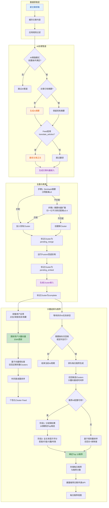
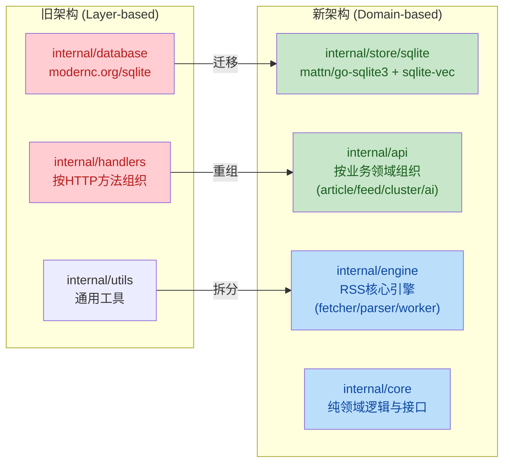

## 1. 高层摘要 (TL;DR)

*   **影响范围**: 🔴 **高** - 重大架构升级与AI功能引入
*   **核心变更**:
    *   🧠 **AI增强模式**: 新增完整的文章去重、聚类、兴趣追踪和每日推荐系统
    *   🗄️ **数据库迁移**: 从 `modernc.org/sqlite` 迁移到 `mattn/go-sqlite3` + `sqlite-vec`,支持向量嵌入
    *   🏗️ **架构重构**: 后端从"分层结构"转向"领域驱动",前端采用"Feature Slices"模式
    *   📦 **前端增强**: 新增 Markdown 渲染支持,翻译内容缓存,组件拆分优化

---

## 2. 可视化概览 (代码与逻辑映射)

### 2.1 AI增强模式数据流



### 2.2 架构重构映射



---

## 3. 详细变更分析

### 3.1 数据库层重构 (核心变更)

#### 组件: `internal/store/sqlite`

**变更说明**:
- 从 `modernc.org/sqlite` 迁移到 `github.com/mattn/go-sqlite3` (CGO驱动)
- 集成 `sqlite-vec-go-bindings` 支持向量相似度搜索
- 新增启动自检机制 `StartupCheck()`,验证驱动版本、Vec版本、PRAGMA配置

**关键方法**:
| 方法名 | 功能 | 来源文件 |
|--------|------|----------|
| `NewDB()` | 创建数据库连接,注册自定义驱动 | `db.go` |
| `StartupCheck()` | 验证SQLite/Vec版本和PRAGMA配置 | `startup_check.go` |
| `applyConnectionPragmas()` | 应用WAL模式、外键、缓存等优化 | `db.go` |
| `initVecSchema()` | 初始化向量虚拟表(vec0) | `schema.go` |

**数据库Schema变更**:

| 表名 | 新增字段 | 说明 |
|------|----------|------|
| `articles` | `simhash_64`, `simhash_b1~b4` | SimHash去重数据 |
| `articles` | `cluster_id` | 关联到聚类 |
| `clusters` | *(新表)* | 文章聚类,包含融合内容、推荐分数 |
| `daily_recommendations` | *(新表)* | 每日推荐记录 |
| `article_embeddings` | *(新表)* | 文章向量嵌入 |
| `cluster_embeddings` | *(新表)* | 聚类向量嵌入 |
| `users` | `interest_vector`, `ai_read_count`, `ai_total_read_time` | 兴趣追踪数据 |

**依赖变更**:

| 包 | 旧版本 | 新版本 | 说明 |
|----|--------|--------|------|
| `modernc.org/sqlite` | v1.44.3 | ❌ 已移除 | 纯Go SQLite驱动 |
| `github.com/mattn/go-sqlite3` | - | v1.14.24 | CGO SQLite驱动 |
| `github.com/asg017/sqlite-vec-go-bindings` | - | v0.1.6 | 向量搜索扩展 |

---

### 3.2 AI增强模式 (新增功能)

#### 组件: `internal/dedup/pipeline`

**变更说明**:
- 实现两阶段去重: SimHash候选预筛 + 基于摘要向量中心的语义入簇
- 使用鸽巢原理(Pigeonhole Principle)加速SimHash候选检索
- 自动将相似文章合并到同一Cluster

**核心常量**:
```go
const (
    SimHashThreshold = 3          // SimHash汉明距离阈值
    SemanticDistanceThreshold = 0.4 // 归一化平方欧氏距离阈值
)
```

**处理流程**:
1. `ProcessArticle()` - 主入口
2. `ComputeSimHash64()` - 计算SimHash
3. `FindSimHashCandidates()` - 通过bands检索候选
4. `semanticSearch()` - 基于摘要向量的候选簇中心比较
5. `joinCluster()` / `createStandaloneCluster()` - 分配到聚类

#### 组件: `internal/interest/interest`

**变更说明**:
- 实现三层兴趣追踪系统(点击/深度阅读/收藏)
- 使用EMA(指数移动平均)更新兴趣向量
- L2归一化确保向量稳定性
- 冷启动:从收藏的聚类嵌入初始化兴趣向量

**学习率配置**:
| 交互类型 | 学习率 (α) | 说明 |
|----------|-----------|------|
| 点击 | 0.05 | 浅层兴趣 |
| 深度阅读 | 0.10 | 深度兴趣 (阅读时间 > 平均值) |
| 收藏 | 0.20 | 核心兴趣 |

**关键方法**:
```go
// EMA更新公式
u_new = (1 - α) * u_old + α * v
u_final = u_new / ||u_new||
```

#### 组件: `internal/feed/ai_daily_recommendation`

**变更说明**:
- 实现每日Top 10推荐生成
- 两阶段评分:分组锦标赛(摘要) + 全文多因子评分
- 支持规则回退(无AI配置时)
- 自动调度与缺失天回填

**评分维度**:
| 维度 | 说明 |
|------|------|
| Information Density | 信息密度 |
| Practical Value | 实用价值 |
| Interestingness | 有趣程度 |
| Timeliness | 时效性 |

**调度逻辑**:
- 每分钟检查是否需要生成推荐
- 避免与Feed刷新时间冲突(30分钟缓冲区)
- 支持手动触发和自动触发

---

### 3.3 架构重构 (后端)

#### 组件: 目录结构重组

**变更说明**:
- `internal/database` → `internal/store/sqlite`
- `internal/handlers` → `internal/api` (按业务领域组织)
- 新增 `internal/engine` (RSS核心引擎)
- 新增 `internal/core` (纯领域逻辑)

**文件迁移示例**:

| 旧路径 | 新路径 |
|--------|--------|
| `internal/database/db.go` | `internal/store/sqlite/db.go` |
| `internal/database/init.go` | `internal/store/sqlite/init.go` |
| `internal/handlers/core/handler.go` | `internal/api/core/handler.go` |
| `internal/feed/fetcher.go` | `internal/engine/fetcher/fetcher.go` (计划) |

**main.go 变更**:
```go
// 旧导入
import "MavenRSS/internal/database"
db, err := database.NewDB(dbPath)

// 新导入
import "MavenRSS/internal/store/sqlite"
db, err := sqlite.NewDB(dbPath)

// 新增启动检查
startupCheck, err := db.StartupCheck()
```

---

### 3.4 前端重构与增强

#### 组件: `frontend/src/features/article`

**变更说明**:
- 从 `components/article` 迁移到 `features/article/components`
- 拆分 `ArticleContent.vue` 的翻译逻辑
- 新增翻译内容缓存机制

**新增依赖**:

| 包 | 版本 | 用途 |
|----|------|------|
| `marked` | v17.0.5 | Markdown解析 |
| `dompurify` | v3.3.3 | HTML净化(XSS防护) |
| `@types/marked` | v5.0.2 | TypeScript类型定义 |
| `@types/dompurify` | v3.0.5 | TypeScript类型定义 |

**翻译缓存机制**:

```typescript
// 保存翻译内容到数据库
async function saveTranslatedContent(
  articleId: number,
  content: string,
  targetLang: string,
  provider: string = 'unknown'
): Promise<void>

// 从数据库加载翻译内容
async function loadTranslatedContent(
  articleId: number,
  targetLang: string
): Promise<string | null>
```

**Store拆分**:
- `stores/app.ts` → `features/article/store.ts` + `features/feed/store.ts`
- 使用 `useArticleStore()` 和 `useFeedStore()` 替代单一全局store

#### 组件: `frontend/src/shared`

**变更说明**:
- 创建共享层 `shared/ui` (通用组件)
- 创建共享层 `shared/lib` (纯TS工具)
- 迁移 `BaseModal`, `ConfirmDialog`, `Toast` 等组件

**工具函数迁移**:

| 旧路径 | 新路径 |
|--------|--------|
| `utils/mediaProxy.ts` | `shared/lib/mediaProxy.ts` |
| `utils/authFetch.ts` | `shared/lib/authFetch.ts` |
| `components/article/useContentTranslation.ts` | `features/article/composables/useContentTranslation.ts` |

---

### 3.5 配置与文档

#### 组件: `README.md`

**变更说明**:
- 新增"AI-Enhanced Mode"章节,详细说明AI功能
- 添加完整的AI处理流程图(Mermaid)
- 更新部署说明和依赖要求

**新增内容**:
- 文章去重与聚类机制
- 兴趣向量追踪说明
- AI每日推荐流程
- 自动化AI工作流描述

#### 组件: `REFACTOR_PLAN.md`

**变更说明**:
- 新增架构重构计划文档
- 定义从"分层结构"到"领域驱动"的迁移路径
- 明确文件拆分策略(针对超大文件)

**关键策略**:
- 后端:按业务领域组织API(article/feed/cluster/ai)
- 前端:采用Feature Slices模式
- 文件长度控制:拆分 >2000行的"God Files"

---

## 4. 影响与风险评估

### 4.1 破坏性变更

| 变更类型 | 影响范围 | 迁移建议 |
|----------|----------|----------|
| **数据库驱动更换** | 所有数据库操作 | 需要重新编译(CGO依赖),现有数据库文件兼容 |
| **导入路径变更** | 所有Go文件 | 批量替换 `internal/database` → `internal/store/sqlite` |
| **前端Store拆分** | Vue组件 | 更新 `useAppStore()` → `useArticleStore()` / `useFeedStore()` |
| **API路径变更** | 前端API调用 | 检查所有 `/api/` 路径是否保持一致 |

### 4.2 性能影响

| 方面 | 预期影响 | 说明 |
|------|----------|------|
| **数据库性能** | ⬆️ 提升 | CGO驱动性能优于纯Go驱动,WAL模式提升并发 |
| **向量搜索** | ➕ 新增 | 支持语义相似度检索,但增加存储开销 |
| **启动时间** | ⬇️ 增加 | 新增启动自检,但确保配置正确 |
| **内存占用** | ⬆️ 增加 | 向量嵌入和兴趣向量需要额外内存 |

### 4.3 测试建议

#### 后端测试:
1. ✅ 验证数据库迁移:启动应用,检查 `StartupCheck()` 输出
2. ✅ 测试AI管道:创建新文章,验证摘要、翻译、嵌入、聚类流程
3. ✅ 测试去重功能:发布相似文章,验证SimHash和向量去重
4. ✅ 测试每日推荐:手动触发推荐生成,验证Top 10结果
5. ✅ 测试兴趣追踪:模拟点击/深度阅读/收藏,验证兴趣向量更新

#### 前端测试:
1. ✅ 验证翻译缓存:翻译文章后刷新,确认从缓存加载
2. ✅ 验证Markdown渲染:发布Markdown格式文章,检查渲染正确性
3. ✅ 验证Store拆分:检查所有组件正确使用新的feature stores
4. ✅ 验证组件迁移:检查所有导入路径是否正确更新

#### 集成测试:
1. ✅ 端到端AI流程:抓取 → 摘要 → 翻译 → 去重 → 聚类 → 推荐
2. ✅ 多用户场景:验证每个用户的兴趣向量和推荐独立
3. ✅ 性能测试:向量搜索响应时间 < 100ms (Top-5)

---

## 5. 技术亮点

### 🧪 三层兴趣追踪系统
- **Level 1 (点击)**: α=0.05 - 浅层兴趣,快速响应
- **Level 2 (深度阅读)**: α=0.10 - 深度兴趣,基于阅读时间
- **Level 3 (收藏)**: α=0.20 - 核心兴趣,强烈信号

### 🔍 两阶段去重算法
- **SimHash**: 快速字面去重,汉明距离≤3
- **摘要向量语义**: 深度语义去重,归一化平方欧氏距离≤0.4
- **鸽巢原理**: 4个bands加速候选检索

### 📊 两阶段推荐评分
- **阶段1**: 分组锦标赛,基于摘要快速筛选
- **阶段2**: 全文多因子评分,密度/价值/兴趣/时效

### 🏗️ 领域驱动架构
- **后端**: 按业务领域组织(article/feed/cluster/ai)
- **前端**: Feature Slices模式,高内聚低耦合

---

## 6. 后续工作建议

1. **性能优化**:
   - 向量索引优化(考虑HNSW)
   - 批量嵌入生成减少API调用
   - 缓存策略优化(翻译/摘要)

2. **功能完善**:
   - AI配置UI(推荐阈值、学习率调整)
   - 聚类可视化(时间线、相似度图谱)
   - 兴趣向量可视化(雷达图)

3. **文档补充**:
   - AI模式配置指南
   - 向量维度选择说明
   - 冷启动策略文档

4. **监控告警**:
   - AI任务失败率
   - 向量搜索延迟
   - 推荐质量指标(点击率、收藏率)
